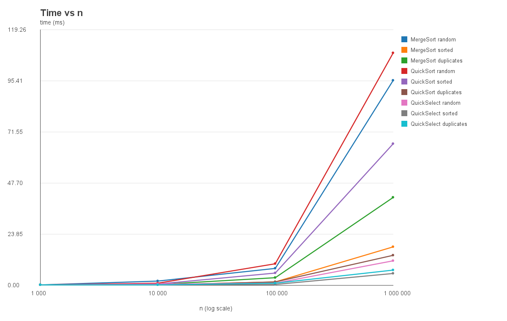
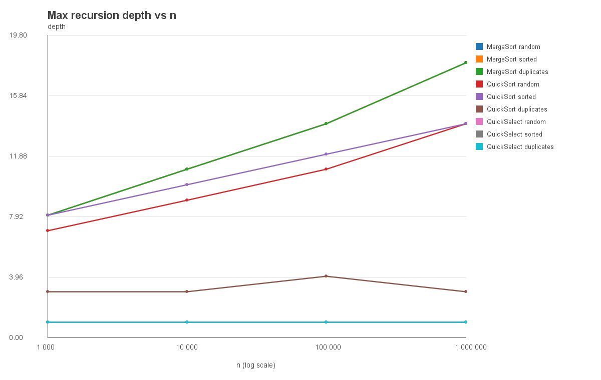
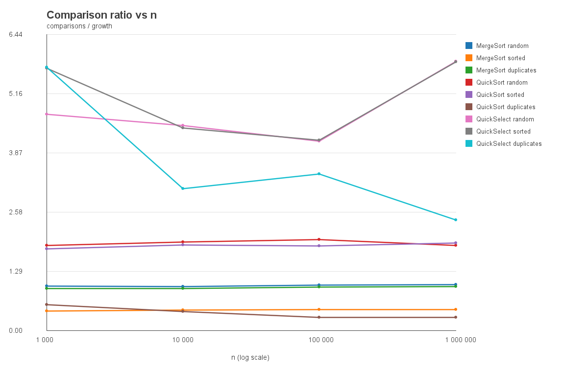

# Assignment 1 Report

## Design and Analysis of Algorithms

## 1. Algorithms

This project implements three divide-and-conquer algorithms:

* MergeSort
* QuickSort
* QuickSelect

The MergeSort implementation uses a single reusable buffer instead of creating a new temporary array during every merge. For small subarrays of size 15 or less, it switches to Insertion Sort to reduce the overhead of recursive calls.

QuickSort uses a randomly selected pivot together with 3-way partitioning. To avoid unnecessary recursion depth, only the smaller partition is processed recursively, while the larger partition is handled using a loop.

QuickSelect uses the same 3-way partitioning approach as QuickSort. The main difference is that it does not process both sides of the partition. It only continues in the part that contains index `k`.

---

## 2. Asymptotic Bounds

| Algorithm      | Best Case  | Average Case | Worst Case |
| -------------- | ---------- | ------------ | ---------- |
| MergeSort      | Θ(n log n) | Θ(n log n)   | Θ(n log n) |
| QuickSort      | Θ(n log n) | Θ(n log n)   | Θ(n²)      |
| QuickSelect    | Θ(n)       | Θ(n)         | Θ(n²)      |
| Insertion Sort | Θ(n)       | Θ(n²)        | Θ(n²)      |

### MergeSort

MergeSort has a time complexity of Θ(n log n) in the best, average, and worst cases.

The reason is that the array is repeatedly divided into two halves, giving roughly `log n` levels of recursion. At each level, merging processes all `n` elements.

Because this process does not depend much on the original ordering of the input, sorted, random, and reverse-sorted arrays all have the same asymptotic running time.

### QuickSort

QuickSort performs best when each pivot splits the array into two approximately equal parts. In that case, its running time is Θ(n log n).

Its expected running time is also Θ(n log n). Since the pivot is selected randomly, consistently producing extremely poor partitions is unlikely.

The worst case is Θ(n²). This can happen when each pivot repeatedly produces a very unbalanced split, such as separating only one element from the rest of the array.

### QuickSelect

QuickSelect has a best-case and expected running time of Θ(n).

Unlike QuickSort, it does not continue into both partitions. After partitioning the array, it keeps only the side that contains the requested position `k`.

The worst case is still Θ(n²). This happens when the pivot repeatedly creates highly unbalanced partitions and the target position remains inside the larger part.

### Insertion Sort

Insertion Sort runs in Θ(n) time when the input is already sorted because each element only needs to be checked once.

Its average and worst-case running times are Θ(n²). A typical worst case is an array sorted in reverse order.

In this project, however, Insertion Sort is only used for subarrays of size 15 or less, so its quadratic complexity does not have a significant effect on the overall MergeSort complexity.

---

## 3. Recurrence Relations

### MergeSort

For MergeSort, the recurrence is:

T(n) = 2T(n / 2) + Θ(n)

Here:

* a = 2
* b = 2
* f(n) = Θ(n)

We get:

n^(log_b(a)) = n^(log₂2) = n

Therefore:

f(n) = Θ(n^(log_b(a)))

This matches Case 2 of the Master Theorem.

So:

T(n) = Θ(n log n)

The switch to Insertion Sort does not change this asymptotic bound because the cutoff value is constant.

---

### QuickSort

If the pivot produces a balanced partition, the recurrence can be written as:

T(n) = 2T(n / 2) + Θ(n)

Here:

* a = 2
* b = 2
* f(n) = Θ(n)

Again:

n^(log_b(a)) = n

This corresponds to Case 2 of the Master Theorem, which gives:

T(n) = Θ(n log n)

In the actual implementation, the pivot is chosen randomly. Because of that, the exact partition sizes vary from one execution to another. The expected running time is O(n log n), although the theoretical worst case is still O(n²).

Another important detail is the recursion strategy. The implementation recursively processes only the smaller partition and continues with the larger partition in a loop. This keeps the recursion stack bounded by O(log n).

---

### QuickSelect

For a balanced partition, QuickSelect continues into only one half of the array:

T(n) = T(n / 2) + Θ(n)

In this case:

* a = 1
* b = 2
* f(n) = Θ(n)

We have:

n^(log_b(a)) = n^(log₂1) = 1

Since Θ(n) grows polynomially faster than 1, this falls under Case 3 of the Master Theorem.

Therefore:

T(n) = Θ(n)

The reason QuickSelect can achieve linear expected time is that it does not sort both partitions. After every partitioning step, only the side containing position `k` needs to be processed.

---

## 4. Benchmark

The algorithms were tested on arrays of the following sizes:

* 1,000
* 10,000
* 100,000
* 1,000,000

Three different input types were used:

* random
* sorted
* duplicates

For the duplicates case, the array contains randomly generated values from 0 to 9. This creates many repeated elements and is useful for showing the effect of 3-way partitioning.

Each benchmark case was executed five times. Instead of taking the average, the median execution time was recorded. This helps reduce the effect of unusual runs caused by JVM warm-up, Garbage Collection, or temporary system load.

The benchmark collects three metrics:

* execution time in milliseconds
* number of comparisons
* maximum recursion depth

All measured values are stored in `results.csv`.

---

## 5. Time vs n

As expected, execution time increases as the input size grows.

MergeSort shows relatively predictable behavior across the three input types. This makes sense because its recursive splitting and merging process is mostly independent of the initial order of the elements.

QuickSort is less predictable because its performance depends on the partitions produced by randomly selected pivots. However, the use of 3-way partitioning is especially helpful for arrays with many duplicate values, since elements equal to the pivot can be handled together.

QuickSelect is usually faster than performing a complete sort when only one order statistic is needed. It does less work because it continues into only one relevant partition instead of sorting the entire array.

---

## 6. Maximum Recursion Depth

MergeSort has logarithmic recursion depth because the array is divided approximately in half at every recursive step.

QuickSort is designed differently. Only the smaller partition is processed recursively, while the larger one is handled iteratively. This prevents the call stack from growing too much, even when the partition sizes are uneven.

To check this behavior, the depth test for QuickSort uses a sorted array containing 100,000 elements and verifies the following condition:

maxDepth <= 2 × log2(n)

QuickSelect does not use recursion in this implementation. It continues using a loop, so recursive stack depth is not an issue for this algorithm.

---

## 7. Ratio vs n

For MergeSort and QuickSort, the following ratio was calculated:

comparisons / (n × log2(n))

For QuickSelect, the following ratio was calculated:

comparisons / n

If the measured number of comparisons follows the expected Θ growth, this ratio should stay within an approximately constant range as n becomes large.

### MergeSort

For MergeSort, the ratios for n = 100,000 and n = 1,000,000 were:

| Input | n = 100,000 | n = 1,000,000 |
|---|---:|---:|
| random | 0.987 | 0.998 |
| sorted | 0.448 | 0.455 |
| duplicates | 0.940 | 0.950 |

The ratios become very stable for large n.

Using all tested input types for n >= 100,000, rough empirical constants are:

c1 ≈ 0.44  
c2 ≈ 1.00  
n0 ≈ 100,000

Therefore, for the measured data:

0.44 × n log2(n) <= comparisons <= 1.00 × n log2(n)

for n >= 100,000.

This strongly supports the expected Θ(n log n) comparison growth of MergeSort.

### QuickSort

For QuickSort, the ratios were:

| Input | n = 100,000 | n = 1,000,000 |
|---|---:|---:|
| random | 1.976 | 1.851 |
| sorted | 1.840 | 1.897 |
| duplicates | 0.283 | 0.286 |

For random and sorted input, the ratio stays around 1.8-2.0.

The duplicates input has a much smaller ratio because the 3-way partition processes all elements equal to the pivot together. Since the duplicates benchmark contains only values from 0 to 9, QuickSort can eliminate large groups of equal elements in a single partition.

Using all tested input types for n >= 100,000, rough empirical constants are:

c1 ≈ 0.28  
c2 ≈ 1.98  
n0 ≈ 100,000

Therefore, for the measured data:

0.28 × n log2(n) <= comparisons <= 1.98 × n log2(n)

for n >= 100,000.

The random and sorted measurements are consistent with the expected Θ(n log n) average behavior. The duplicates case performs better because of 3-way partitioning.

### QuickSelect

For QuickSelect, the ratios comparisons / n were:

| Input | n = 100,000 | n = 1,000,000 |
|---|---:|---:|
| random | 4.115 | 5.859 |
| sorted | 4.135 | 5.838 |
| duplicates | 3.399 | 2.400 |

The QuickSelect ratio varies more than the sorting ratios because the pivot is selected randomly and only one partition is followed. Different pivot choices can therefore noticeably change the number of comparisons.

However, the ratio remains bounded by a constant range instead of growing with n.

Using all tested input types for n >= 100,000, rough empirical constants are:

c1 ≈ 2.40  
c2 ≈ 5.86  
n0 ≈ 100,000

Therefore, for the measured data:

2.40 × n <= comparisons <= 5.86 × n

for n >= 100,000.

This is consistent with the expected Θ(n) average behavior of QuickSelect.
---

## 8. Discussion

Overall, the experimental results are consistent with the theoretical complexity analysis.

MergeSort gives the most predictable results because its behavior changes very little with the initial order of the input. Its running time follows the expected `n log n` growth across random, sorted, and duplicate-heavy arrays.

QuickSort also shows behavior close to `n log n` on average, although its results naturally vary more. Since the pivot is selected randomly, two runs on similar inputs can still produce different partition shapes and different comparison counts.

The effect of 3-way partitioning is especially noticeable when many duplicate values are present. Instead of repeatedly moving equal values between partitions, all values equal to the pivot are grouped together in a single partitioning step.

QuickSelect generally performs fewer operations than the full sorting algorithms because it only needs to locate one position. Once the pivot is placed, the algorithm can ignore whichever side does not contain `k`.

Benchmark timing is also affected by factors outside the algorithms themselves. The first few JVM executions may be slower because of class loading and Just-In-Time compilation. Garbage Collection can occasionally increase execution time, while CPU caching may make some array sizes behave better than expected. These effects are one reason the benchmark repeats each case five times and records the median instead of relying on a single run.

The MergeSort cutoff is another practical optimization. For very small subarrays, the overhead of recursive MergeSort calls can cost more than the simpler operations used by Insertion Sort. Switching algorithms at a fixed size improves practical performance without changing the overall asymptotic complexity.

The comparison ratios are particularly useful because they make it easier to see the growth trend independently of the absolute input size. If the normalized ratios remain relatively stable for large values of `n`, the measurements agree with the expected Θ bounds.

---

## 9. Conclusion

This project implements MergeSort, QuickSort, and QuickSelect using divide-and-conquer techniques, while also including several practical optimizations.

MergeSort uses a reusable auxiliary buffer and switches to Insertion Sort for small subarrays.

QuickSort uses random pivots and 3-way partitioning, while its smaller-partition recursion strategy keeps stack usage under control.

QuickSelect reuses the same partitioning logic but avoids sorting unnecessary parts of the array by continuing only toward the target position.

The benchmark results, recursion-depth measurements, and normalized comparison ratios are consistent with the expected theoretical complexities of the three algorithms.
